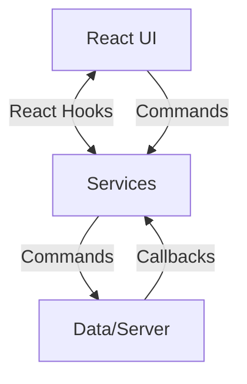
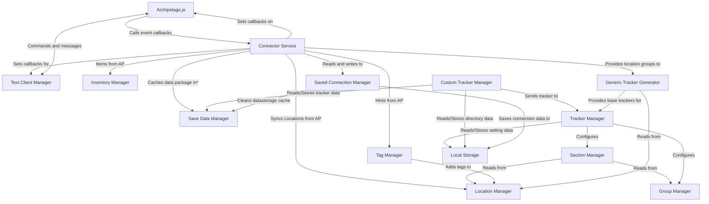

# Project Architecture Overview

This project primarily uses these libraries to function:

- ReactJS: For creating the UI
- NextJS: For building and deploying the app
- Archipelago.js: For communicating with archipelago servers

The app is primarily written in Typescript.

## Data flow and structure:

The app has 3 primary layers:

- A UI or View layer:
    - Consists primarily of functional React components, the purpose is to display data provided by the services, usually obtained from a React Hook designed for the retrieved data.
- A Service Layer

    - Consists of the logic code for the app. These layers provide interfaces for both the UI and the Server to communicate effectively, while abstracting them from each other. Most services are designed to have data passed into them and be managed by another service or piece of code and normally called a `manager`. For example the `locationManager` service provides a way for React to get the data it needs to display a location name and any tags related to it. The `locationManger` is populated and maintained via callbacks established by the `connector` service linked to Archipelago.js event handlers. There are also other services that interact with the `locationManger` to provide data to it. Documentation for each service is provided at (TBD).

- A Data/Server layer
    - Consists primarily of Archipelago.js and Browser storage API's

Simple version:



## Services

Service outline and Data flow:



#### Notes on graph:

- Direction of arrows show which service starts the action.
- This shows how things currently are, not how they should be.
- With the exception of the Text Client Manager and the connector, most services are designed to function in the absence of Archipelago.js to some capacity.
- \*Datapackage caching functionality currently does not work due to a bug in the release version of Archipelago.js.

### Using services:

#### From the UI:

The main way for the UI to interface with a service comes from the React context `ServiceContext` and a special hook. The service context has most of the services attached to it and is defined in [src/contexts/serviceContext.ts](../../src/contexts/serviceContext.ts) and is created at the root of the app and can be accessed via React's `useContext` method.

The service should be passed to corresponding hook to allow React to update in response to events with in the service.

Example, using the `inventoryManager` and `optionManager` services and their related hooks from the [InventoryView](../../src/components/inventoryComponents/InventoryView.tsx):

```typescript
import React, { useContext, useMemo, useState } from "react";
import { useInventoryItems } from "../../hooks/inventoryHook";
import ServiceContext from "../../contexts/serviceContext";
import { globalOptionManager } from "../../services/options/optionManager";
import useOption from "../../hooks/optionHook";
// ... more imports

const InventoryView = () => {
    const services = useContext(ServiceContext);
    const inventoryManager = services.inventoryManager;
    const optionManager = services.optionManager ?? globalOptionManager;
    if (!inventoryManager) {
        throw new Error(
            "Inventory manager not provided to inventory view service list"
        );
    }
    // ...
    const showProgression = useOption(
        optionManager,
        "inventory_show_prog_items",
        "global"
    ) as boolean | null;
   // ...

    const items = useInventoryItems(inventoryManager);
    const sortedItems = useMemo(() => {
       //...
    });
    return (
        <>
            {/*... Use those the data to render the component*/}
        </>
    )
};

export default InventoryView;

```

#### From another service:

If one service depends on another, the dependencies should be passed in to the service as arguments on creation.

Example in [App.tsx](../../src/App.tsx)

```typescript
const locationManager = new LocationManager();
// ...
const entranceManager = createEntranceManager();
// ...
const groupManager = createGroupManager(entranceManager);
const sectionManager = createSectionManager(
    locationManager,
    entranceManager,
    groupManager
);
```

#### How should a service be created:

If the service is intended to be a singleton (only one should exist for the whole app), it is best to create this as a dedicated object that is shared and exported. One example of this kind of service is [SaveData](../../src/services/saveData.ts). There is no reason (outside of tests) to replace these objects on different service contexts.

If the service is intended to be scoped and allow for multiple to exist at once, then a Class based or factory based creation method is preferred, an example can be found in the [LocationManager](../../src/services/locations/locationManager.ts) Writing services in this way allows for the easy creation of alternative service contexts for use in testing and demonstration purposes. One example of such a use case is in the [checklist settings](../../src/components/optionsComponents/ChecklistSettings.tsx) where multiple mock services are created to display the effect each option has on a real list of locations without needing to use all the locations that their game may have loaded (note that these services are created outside of the react component to not link them to the lifecycle of the component).

### Services:

#### [Connector](../../src/services/connector/connector.ts) (singleton):

The primary driver of communication between `archipelago.js` and the rest of the app. This service:

- Sets up location, item, and hint syncing callbacks on archipelago.js events to other services that may need them
- Manages log-in to the archipelago server

#### [EntranceManager](../../src/services/entrances/entranceManager.ts) (outdated and unused):

Manages saving and loading of entrance related data. It is currently a remnant of older code that never saw a release and needs to be rewritten to work with the current code base.

related hook: [useEntrance ](../../src/hooks/entranceHook.ts)

#### [InventoryManager](../../src/services/inventory/inventoryManager.ts):

Manages the inventory of the current session and groups the items into collections.

Related hook: [useInventoryItems](../../src/hooks/inventoryHook.ts)

#### [LocationManager](../../src/services/locations/locationManager.ts):

Manages the status and tags of locations within a session.

Related hook: [useLocationStatus](../../src/hooks/sectionHooks.ts).

#### [NotificationManager](../../src/services/notifications/notifications.ts):

Manages the routing of notifications to listeners.

Related hook: none, listeners are best subscribed to directly. Remember to clean up listeners when they are no longer needed.

#### [OptionsManager](../../src/services/options/optionManager.ts):

Manages the settings and saving of options shared across the app.

Related hook: [useOption](../../src/hooks/optionHook.ts)

#### [SavedConnectionsManager](../../src/services/savedConnections/savedConnectionManager.ts) (singleton):

Maintains a saved list of previous connections as well as per-session save data.

Related hook: none but should have one, this is currently subscribed to using `useSyncExternalStore`

#### [GroupManager](../../src/services/sections/groupManager.ts):

Maintains a list of groups and what locations are contained with-in. Has some unused properties related to entrances and section collapsing that is currently not used.

No hooks.

#### [SectionManager](../../src/services/sections/sectionManager.ts):

Maintains the state of the sections and which locations each one has. Build and maintains reports related to tags and location counts.

Related hook: [useSection](../../src/hooks/sectionHooks.ts).

#### [TagManager](../../src/services/tags/tagManager.ts):

Manages tags placed on locations by submitting them as updates to the LocationManager, and saving appropriate ones to the SavedConnectionManager.

No hooks.

#### [Theme](../../src/services/theme/theme.ts):

Mostly just decodes the theme option into a theme recognized by the CSS code, taking into account system preferences. Will be expanded at a later point in time.

#### [SaveData](../../src/services/saveData.ts):

Stores registered keys into `IndexedDB`, must be updated directly to add new databases. This is mostly used for large data that would quickly outgrow the capacity of `localstorage` such as archipelago data packages and custom tracker files.

No hooks.

#### [TextClientManager](../../src/services/textClientManager.ts):

Manages messages sent from archipelago.js and processes user input for the Text Client.

Related hooks: [useTextClientMessages, useTextClientHistory](../../src/hooks/textClientHook.ts)

#### [TrackerManager](../../src/games/TrackerManager.ts):

Manages the loading and creation of trackers by updating the Group and Section managers.

Related Hooks: [useCurrentGameTracker, useTrackerDirectory](../../src/hooks/trackerHooks.ts)

#### [CustomTrackerManager](../../src/games/generic/categoryGenerators/customTrackerManager.ts) (singleton, defined in the games folder):

Manages the loading, storing, creation and validation of custom trackers loaded by the user.

Related Hooks: [useCustomTrackerDirectory](../../src/hooks/trackerHooks.ts)

#### [GenericTrackerGenerator](../../src/games/generic/genericGame.ts):

A collection of code that analyzes location names and groups to build a usable `Tracker` out of them.

Note that this is not a real service, but I for some reason included this in the chart and felt obligated to put it here.

## Data and server layer:

### Archipelago.js

A library for getting connected to the archipelago server. [Repository link](https://github.com/ThePhar/archipelago.js), [Documentation](https://archipelago.js.org/stable/)

### Browser API's:

localstorage and IndexedDB

## File structure:

All code related to the app should be in the `src` folder. Here is an outline of the folders within `src`:

- `app`: this folder is the root of the application in terms of navigation. It contains a single `[[../slug]]` folder that tells NextJS to render our `App.tsx` as the main component of the app. There is nothing really interesting here apart from the icons and should not need to be changed often as the app runs as a single page application.

- `components`: All React UI components go here. If a component will have one or more child components, place these in a folder together with a descriptive name. If a component is intended to be reused across the app, place it in the `shared` folder or the `LayoutUtilities` folder (with layout utilities being used for common layouts).

- `constants`: Global constants should be placed here if they don't make sense else where, at the moment this just holds a list of color strings.

- `contexts`: This contains any React Context that is intended to be used across the app.

- `games`: This folder is planned to have different built-in trackers and code for routing that is built, however this currently just home to the `generic` game for building trackers based on location groups and location names.

- `hooks`: This folder holds all React Hooks for use across the app

- `services`: This folder contains the code for the service layer

- `utility`: Code that is not a service but may be shared across the app. Currently this contains code related to natural sorting, downloading json files,
  and random id generation.
